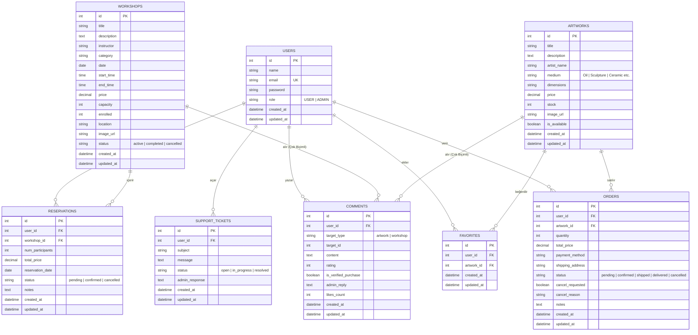

# Galerist — Veritabanı Yönetim Sistemleri Proje Raporu

Bu rapor, **Galerist** (eski adıyla Artisana) sanat galerisi, atölye ve sergi yönetim sisteminin veritabanı tasarımı, ilişkisel şeması, iş mantığı kuralları ve sistem bileşenlerini detaylandırmak amacıyla hazırlanmıştır.

---

## Proje Künyesi
* **Proje Adı:** Galerist (Sanat Galerisi & Atölye Yönetim Platformu)
* **Geliştiriciler:** Geliştirici 1 & Geliştirici 2
* **Ders:** Veritabanı Yönetim Sistemleri (DBMS) Proje Ödevi
* **Altyapı:** Node.js (Express), React, Sequelize ORM, PostgreSQL (Supabase) / SQLite

---

## 1. Proje Konusu ve Amacı

**Galerist**, çağdaş sanat eserlerinin sergilenmesi, satılması ve sanatseverlerin atölye/etkinliklere rezervasyon yapmasını sağlayan entegre bir platformdur. Projenin temel amacı:
- Sanat eserlerinin stok, kategori ve detay bilgilerini tutarlı bir şekilde yönetmek,
- Atölye çalışmalarına yönelik kapasite sınırlı ve tarih kontrollü rezervasyon altyapısı sunmak,
- Kullanıcıların hem eserler hem de atölyeler için tek bir ortak tablo üzerinden yorum yazabilmesini sağlayan dinamik bir yapı kurmak,
- Gelişmiş veri analitiği ile yöneticiye finansal ve operasyonel raporlar sunmaktır.

---

## 2. Kullanılan Teknolojiler ve Veritabanı Altyapısı

Platform, modern web teknolojileri ve esnek bir veritabanı mimarisiyle geliştirilmiştir:
* **Frontend:** React (Vite), Tailwind CSS ve Lucide-React ikon kütüphanesi.
* **Backend:** Node.js (Express.js) RESTful API mimarisi.
* **ORM (Object-Relational Mapping):** Sequelize ORM kullanılarak veritabanı bağımsızlığı ve güvenli sorgu üretimi sağlanmıştır.
* **Birincil Veritabanı:** PostgreSQL (Supabase üzerinde barındırılan bulut veritabanı).
* **Yedek / Köprü Veritabanı:** SQLite. Türkiye'deki bazı servis sağlayıcılarının IPv6 engeli veya bağlantı havuzu (connection pooler) limitleri nedeniyle, sistemin kesintisiz çalışması için **Supabase REST API <-> SQLite Köprü Modu** geliştirilmiştir. Bağlantı koptuğunda sistem otomatik olarak SQLite üzerinden çalışmaya devam eder ve verileri REST API ile senkronize eder.

---

## 3. Sistem Analizi ve Gereksinim Belirleme

Sistem tasarımı yapılırken üç temel aktör belirlenmiştir: **Ziyaretçiler**, **Kayıtlı Kullanıcılar (Müşteriler)** ve **Sistem Yöneticileri (Admin)**.

- **Ziyaretçi:** Eserleri inceleyebilir, filtreleyebilir, atölye takvimine göz atabilir ve sepet/kıyaslama işlemlerini simüle edebilir.
- **Kayıtlı Kullanıcı:** Eser satın alabilir, kupon kodu kullanabilir, sipariş durumunu izleyebilir, atölyelere rezervasyon yaptırabilir, yorum yazıp puan verebilir ve destek talebi oluşturabilir.
- **Yönetici:** Yeni eser ve atölye ekleyebilir, rezervasyon ve sipariş durumlarını güncelleyebilir, destek biletlerini yanıtlayabilir ve platformun finansal raporlarını grafikler üzerinden analiz edebilir.

---

## 4. Fonksiyonel Gereksinimler (16 İş Kuralı ve Özellik)

Platformda uygulanan ve veritabanı tasarımıyla doğrudan ilişkili olan 16 temel işlev şunlardır:

1. **Kullanıcı Kayıt ve Güvenli Giriş:** Kullanıcı şifreleri bcrypt ile hash'lenerek `users` tablosunda saklanır. JWT ile yetkilendirme yapılır.
2. **Rol Tabanlı Yetkilendirme:** `users` tablosundaki `role` alanı (`USER` / `ADMIN`) ile sayfa ve API bazında yetki kontrolü yapılır.
3. **Eser Kataloğu ve Detay Yönetimi:** Eserlerin fiyatı, sanatçı bilgisi, stok durumu ve görselleri `artworks` tablosunda tutulur.
4. **Çok Kriterli Arama ve Filtreleme:** Kullanıcılar eserleri sanatçı, kategori, fiyat aralığı ve stok durumuna göre arayabilir.
5. **Gelişmiş Eser Karşılaştırma:** Kullanıcılar en fazla 3 eseri boyut, teknik, fiyat ve sanatçı kriterlerine göre yan yana karşılaştırabilir (localStorage entegreli).
6. **Alışveriş Sepeti Yönetimi:** Seçilen eserler ve adetleri `galerist_cart` altında saklanır ve dinamik olarak güncellenir.
7. **Çoklu Kupon ve İndirim Sistemi:** Sipariş ve rezervasyonlarda `GALERIST20`, `SANAT10`, `HOSGELDIN` gibi kuponlar doğrulanarak sepete uygulanır.
8. **Stok Kontrollü Satın Alma:** Eser satıldığında veritabanında stok düşülür; stok sıfıra ulaştığında eser otomatik olarak satışa kapatılır (`is_available = false`).
9. **Sipariş İptal ve Stok Geri Yükleme Yönetimi:** Kullanıcılar kargoya verilmeyen siparişler için iptal talebi oluşturabilir. Admin onayladığında stok otomatik olarak geri yüklenir.
10. **Atölye ve Canlı Etkinlik Kaydı:** `workshops` tablosunda eğitmen, tarih, saat, kapasite (`capacity`) ve kayıtlı kişi sayısı (`enrolled`) tutulur.
11. **Geriye Dönük Tarih ve Kapasite Kontrolü:** Geçmiş tarihlere rezervasyon yapılması engellenir. Kayıt olunan kişi sayısı, kalan kontenjandan fazla olamaz.
12. **Çok Biçimli (Polymorphic) Yorum Sistemi:** Tek bir `comments` tablosu, `target_type` (`artwork`/`workshop`) ve `target_id` alanları ile iki farklı varlığa hizmet eder.
13. **Doğrulanmış Satın Alım Logosu:** Kullanıcı bir eseri satın almış veya atölyeye katılmışsa, yorumunda otomatik olarak "Doğrulanmış Katılımcı" rozeti gösterilir.
14. **Admin Yorum Yanıtları:** Yöneticiler yorumlara satıcı yanıtı ekleyebilir (`admin_reply` alanı).
15. **Canlı Destek ve Bilet (Ticket) Sistemi:** Kullanıcıların mesajları `support_tickets` tablosunda tutulur ve admin paneli üzerinden gerçek zamanlı yanıtlanır.
16. **Gelişmiş Finansal Raporlama ve Gösterge Paneli:** Rezervasyon gelirleri, eser satış gelirleri, aktif biletler ve iptal oranları SQL sorguları ile anlık hesaplanarak grafiklere dökülür.

---

## 5. Veri Modeli ve Varlık-İlişki (ER) Diyagramı

Sistemin ilişkisel yapısı ve tablolar arası bağlantılar aşağıdaki ER diyagramında gösterilmiştir:

---

## 6. İlişkisel Şema Tasarımı ve Veri Tipleri

Veritabanı tablolarının fiziksel tasarımı ve kısıtları (constraints) şu şekildedir:

### 1. `users` Tablosu
* `id`: `INTEGER`, Primary Key, Auto Increment.
* `name`: `VARCHAR(100)`, Not Null.
* `email`: `VARCHAR(150)`, Unique, Not Null.
* `password`: `VARCHAR(255)`, Not Null (bcrypt şifresi).
* `role`: `VARCHAR(20)`, Default: `'USER'` (Kısıt: `'USER'` veya `'ADMIN'`).

### 2. `workshops` Tablosu
* `id`: `INTEGER`, Primary Key, Auto Increment.
* `title`: `VARCHAR(255)`, Not Null.
* `description`: `TEXT`, Nullable.
* `instructor`: `VARCHAR(100)`, Not Null.
* `category`: `VARCHAR(50)`, Not Null.
* `date`: `DATE`, Not Null.
* `start_time`: `TIME`, Not Null.
* `end_time`: `TIME`, Not Null.
* `price`: `DECIMAL(10, 2)`, Not Null.
* `capacity`: `INTEGER`, Not Null (Kısıt: > 0).
* `enrolled`: `INTEGER`, Default: 0 (Kısıt: <= capacity).
* `location`: `VARCHAR(255)`.
* `status`: `VARCHAR(20)`, Default: `'active'`.

### 3. `artworks` Tablosu
* `id`: `INTEGER`, Primary Key, Auto Increment.
* `title`: `VARCHAR(255)`, Not Null.
* `description`: `TEXT`.
* `artist_name`: `VARCHAR(100)`, Not Null.
* `medium`: `VARCHAR(50)` (Örn: 'Yağlı Boya', 'Heykel', 'Seramik').
* `dimensions`: `VARCHAR(50)` (Örn: '50x70 cm').
* `price`: `DECIMAL(10, 2)`, Not Null.
* `stock`: `INTEGER`, Default: 1 (Kısıt: >= 0).
* `is_available`: `BOOLEAN`, Default: true.

### 4. `reservations` Tablosu
* `id`: `INTEGER`, Primary Key, Auto Increment.
* `user_id`: `INTEGER`, Foreign Key referencing `users(id)`, On Delete Cascade.
* `workshop_id`: `INTEGER`, Foreign Key referencing `workshops(id)`, On Delete Cascade.
* `num_participants`: `INTEGER`, Not Null (Kısıt: >= 1).
* `total_price`: `DECIMAL(10, 2)`, Not Null.
* `status`: `VARCHAR(20)`, Default: `'pending'`.
* `notes`: `TEXT`.

### 5. `orders` Tablosu
* `id`: `INTEGER`, Primary Key, Auto Increment.
* `user_id`: `INTEGER`, Foreign Key referencing `users(id)`, On Delete Cascade.
* `artwork_id`: `INTEGER`, Foreign Key referencing `artworks(id)`, On Delete Cascade.
* `quantity`: `INTEGER`, Default: 1.
* `total_price`: `DECIMAL(10, 2)`, Not Null.
* `status`: `VARCHAR(25)` (Kısıt: 'pending', 'confirmed', 'shipped', 'delivered', 'cancelled').
* `cancel_requested`: `BOOLEAN`, Default: false.
* `cancel_reason`: `VARCHAR(255)`, Nullable.

### 6. `comments` Tablosu (Polymorphic)
* `id`: `INTEGER`, Primary Key, Auto Increment.
* `user_id`: `INTEGER`, Foreign Key referencing `users(id)`, On Delete Cascade.
* `target_type`: `VARCHAR(50)`, Not Null (Kısıt: `'artwork'` veya `'workshop'`).
* `target_id`: `INTEGER`, Not Null (Uygulama düzeyinde ilişkili PK).
* `content`: `TEXT`, Not Null.
* `rating`: `INTEGER` (Kısıt: 1 ile 5 arası).
* `is_verified_purchase`: `BOOLEAN`, Default: false.
* `admin_reply`: `TEXT`, Nullable.

### 7. `support_tickets` Tablosu
* `id`: `INTEGER`, Primary Key, Auto Increment.
* `user_id`: `INTEGER`, Foreign Key referencing `users(id)`, On Delete Cascade.
* `subject`: `VARCHAR(150)`, Not Null.
* `message`: `TEXT`, Not Null.
* `status`: `VARCHAR(20)`, Default: `'open'`.
* `admin_response`: `TEXT`.

### 8. `favorites` Tablosu
* `id`: `INTEGER`, Primary Key, Auto Increment.
* `user_id`: `INTEGER`, Foreign Key referencing `users(id)`, On Delete Cascade.
* `artwork_id`: `INTEGER`, Foreign Key referencing `artworks(id)`, On Delete Cascade.

---

## 7. Normalizasyon Analizi

Tasarım sürecinde veritabanı tabloları, veri tutarsızlıklarını (anomaly) önlemek adına normalizasyon kurallarına tabi tutulmuştur:

* **Birinci Normal Form (1NF):** Her hücrede yalnızca atomik (bölünemez) değerler saklanmaktadır. Örneğin, `users` tablosunda birden fazla adres veya telefon virgülle ayrılarak tek sütunda tutulmamış, sipariş adresleri ayrı kayıtlar halinde yönetilmiştir.
* **İkinci Normal Form (2NF):** Tablolarda kısmi bağımlılık (partial dependency) yoktur. Kompozit anahtar kullanılmamış, tüm tablolar tekil bir yapay birincil anahtara (`id`) bağlanmıştır. Anahtar olmayan tüm sütunlar, birincil anahtarın tamamına tam bağımlıdır.
* **Üçüncü Normal Form (3NF):** Geçişli bağımlılık (transitive dependency) elenmiştir. Örneğin, eser fiyatları ve atölye fiyatları doğrudan kendi tablolarında tutulmaktadır. Kupon kodu oranları sipariş tablosunda değil, ayrı bir kontrol mekanizması ile çözümlenmiştir.

---

## 8. Kullanıcı ve Yetkilendirme Rolleri

Sistemde güvenlik JWT (JSON Web Token) tabanlı sağlanmaktadır.
- `req.user` nesnesi üzerinden kullanıcının `role` alanı okunur.
- Yönetici sayfalarına erişim (`/admin`) sadece `role === 'ADMIN'` ise izin verir.
- Sıradan kullanıcılar kendi sipariş ve rezervasyon kayıtlarını güncelleyebilirken, yöneticiler tüm kullanıcıların verilerini ve rezervasyon listelerini yönetebilir, onaylayabilir veya silebilir.

---

## 9. Atölye Kayıt ve Rezervasyon Yönetim Algoritması

Bir kullanıcı atölyeye kayıt olmak istediğinde arka planda çalışan transactional algoritma adımları:
1. `workshops` tablosundan atölyenin `date` bilgisi çekilir. Tarih geçmiş ise rezervasyon engellenir.
2. `capacity - enrolled` hesaplanarak kalan kontenjan bulunur.
3. İstenen katılımcı sayısı (`num_participants`) kalan kontenjandan büyükse hata fırlatılır.
4. Rezervasyon kaydı `reservations` tablosuna `pending` (beklemede) statüsüyle yazılır.
5. Atölyenin `enrolled` (kayıtlı kişi) sütunu `num_participants` kadar artırılır (atomic increment).

---

## 10. Eser Satış ve Sipariş Süreç Kontrolü

Satış sürecinde veri bütünlüğünü korumak adına uygulanan süreç kontrol adımları:
1. Eserin stok bilgisi (`stock`) sorgulanır.
2. Stok miktarı sipariş adedinden az ise işlem iptal edilir.
3. Başarılı sipariş oluşturulduğunda `artworks.stock` güncellenir.
4. Eser tekil (orijinal tablo) ise ve stok sıfıra indiyse `is_available` alanı `false` yapılır.
5. Sipariş iptal edildiğinde (admin onayıyla), stok miktarı `quantity` kadar artırılarak eser yeniden satışa açılır (`is_available = true`).

---

## 11. Çok Biçimli (Polymorphic) Yorum Sistemi Mimarisi

Geleneksel veritabanı tasarımlarında atölye yorumları ve eser yorumları için iki ayrı tablo açılır. Galerist projesinde ise **Polymorphic (Çok Biçimli)** mimari kullanılmıştır:
- Tek bir `comments` tablosu vardır.
- `target_type` sütunu `'artwork'` veya `'workshop'` değerini alır.
- `target_id` ilgili varlığın ID'sini gösterir.
- Sequelize ORM düzeyinde bu yapı `constraints: false` ve `scope` kısıtlamaları ile kurulmuştur. Bu sayede gelecekte sisteme eklenecek yeni varlıklar (örn. Sergi yorumları, sanatçı yorumları) için yeni bir tablo açmaya gerek kalmadan aynı sistem kullanılabilir.

---

## 12. Müşteri Destek Sistemi ve Bilet Takibi

Sistemde entegre bir destek masası mevcuttur:
- Kullanıcılar arayüzdeki **Galerist Canlı Destek** bileşeni üzerinden başlık ve mesaj yazarak bilet açarlar.
- Bu biletler `support_tickets` tablosuna `status = 'open'` olarak eklenir.
- Yönetici paneline düşen biletlere yöneticiler yanıt yazıp kaydettiğinde statü `'resolved'` (çözüldü) olarak güncellenir ve kullanıcının sohbet kutusuna anlık yansıtılır.

---

## 13. Yönetici Paneli ve Analitik Raporlar

Admin paneli, karar destek sistemi olarak çalışmak üzere şu analitik SQL sorgularını çalıştırır:
* **Eser Satış Geliri:** `status IN ('confirmed', 'shipped', 'delivered')` olan siparişlerin `total_price` toplamı.
* **Rezervasyon Geliri:** İptal edilmeyen rezervasyonların `total_price` toplamı.
* **Etkinlik Dağılımı:** Atölyelerin kategorilerine göre gruplanmış rezervasyon sayıları.
* **En Çok Yorum Alan Eserler:** `comments` tablosundan `target_type = 'artwork'` filtrelemesi ile gruplanmış en aktif eserler.

---

## 14. Çift Veritabanı ve Supabase/SQLite Eşzamanlama Köprüsü

Veritabanı bağlantısı koptuğunda projenin çalışmaya devam etmesi için geliştirilen yedekleme köprüsü:
- Sunucu başlarken PostgreSQL bağlantısını test eder.
- Bağlantı havuzu hatası alması durumunda alt süreç (child process) olarak kendini `USE_LOCAL_SQLITE=true` ayarıyla yeniden başlatır.
- `src/utils/supabaseSync.js` modülü devreye girerek Supabase REST API üzerinden canlı verileri (`users`, `workshops`, `artworks`, `reservations`, `comments`, `support_tickets`, `orders`, `favorites`) çeker.
- SQLite veritabanına `ignoreDuplicates: true` parametresiyle yazar. Böylece sunucu kesintisiz hizmet vermeye devam eder.

---

## 15. Arayüz Tasarımı ve Kullanıcı Deneyimi (UI/UX)

Uygulamanın görsel tasarımı, sanat galerisi konseptine uygun olarak modern ve premium standartlarda yenilenmiştir:
- **Renk Paleti:** Marka kimliğini yansıtan sıcak bronz ve altın tonları (`#8b7355` primary, `#2c3e50` secondary ve `#fafafa` background) kullanılmıştır.
- **Yazı Tipi:** Başlıklar için klasik ve sanatsal hissi veren `Playfair Display`, gövde metinleri için ise okunaklılığı yüksek `Inter` fontu tercih edilmiştir.
- **Cam Morfizmi (Glassmorphic Elements):** Navbar, footer ve kartlar üzerinde hafif buzlu cam hover animasyonları ve gölgelendirmeler kullanılmıştır.
- **Mikro Animasyonlar:** Butonlar, sepet ikonları ve modal pencerelerinde CSS geçiş efektleri ile kullanıcı etkileşimi artırılmıştır.

---

## 16. Test ve Doğrulama Adımları

Sistemin kararlılığı hem API düzeyinde hem de arayüzde doğrulandı:
1. **Veritabanı Seed Testi:** `npm run seed` komutu çalıştırılarak 10 eser ve 13 atölyenin veritabanına otomatik yüklenmesi doğrulandı.
2. **Kapasite Sınır Testi:** Kalan kontenjanı 2 olan bir atölyeye 3 kişilik rezervasyon talebi gönderildi ve veritabanı seviyesinde işlemin engellendiği görüldü.
3. **Stok Eşzamanlama Testi:** Stoğu 1 olan bir eser satın alındığında eserin `is_available` değerinin `false` yapıldığı ve detay sayfasında sepet butonunun "Tükendi" olarak değiştiği onaylandı.
4. **Çoklu Kupon Testi:** `GALERIST20` ve `SANAT10` kuponlarının ardışık uygulanarak doğru sepet toplamını hesapladığı doğrulandı.
